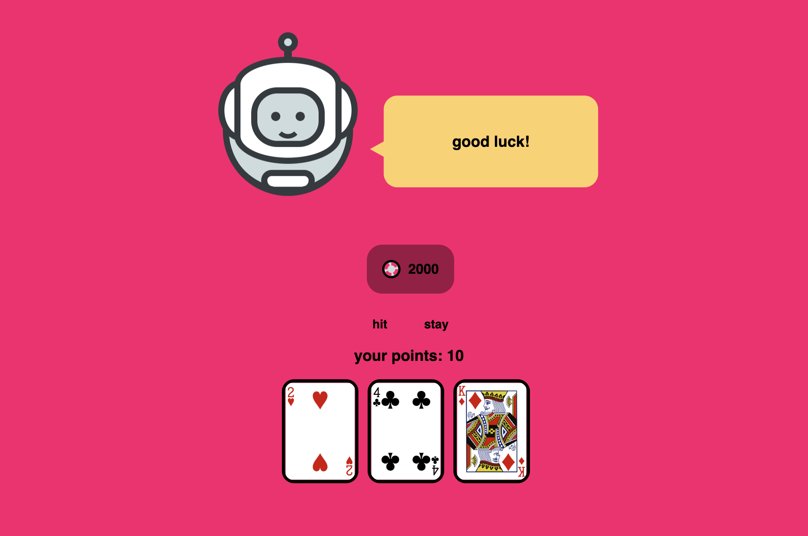

#### Install

`npm install`

#### Run

`npm run dev`

## About The Project

 

 

The project is Black Jack card game.
You need so sign up to start game. Registration implemented using email and password.
Cards were taken from https://deckofcardsapi.com/ api.

## Tools and Packages

- [React](https://reactjs.org/)
- [Redux Toolkit](https://redux-toolkit.js.org/)
- [Typescript](https://www.typescriptlang.org/)
- [React-Hook-Form](https://react-hook-form.com/)
- [React-Router-Dom](https://v5.reactrouter.com/web/guides/quick-start)
- [Vite] (https://vitejs.dev/)
- [Sass] (https://sass-lang.com/)
